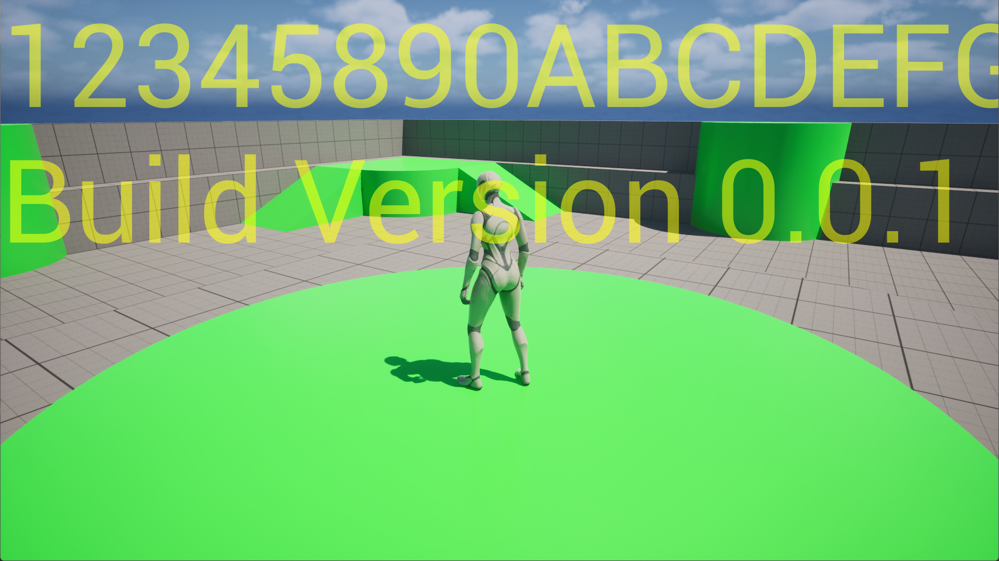

# OofWatermark
Unreal Engine plugin for adding text overlay to the game viewport



## Structure of the plugin
```
OofWatermark
│   OofWatermark.uplugin
│
├───Config
│       BaseOofWatermark.ini
│
├───Content
│   └───OofWatermark
│           BP_OofWatermarkBasic.uasset
│           BP_OofWatermarkCorner.uasset
│
└───Source
    └───OofWatermark
        │   OofWatermark.Build.cs
        │
        ├───Private
        │       OofWatermark.cpp
        │       OofWatermarkSettings.cpp
        │
        └───Public
                OofWatermark.h
                OofWatermarkSettings.h
                OofWatermarkWidget.h
```

## Install the plugin
Copy the top level `OofWatermark` directory into the `Engine/Plugins` or `Project/Plugins` directory.

## Enable the plugin
1. Run the Unreal Editor
2. Open the Plugins window
3. Search for `OofWatermark`
4. Make sure the checkbox for the listed `OofWatermark` plugin is checked

## Customize the plugin
`Project Settings -> Plugins -> OofWatermark`

1. Run the Unreal Editor
2. Open the Project Settings
3. Scroll to the Plugins section
4. Click on `OofWatermark` section

### Use the default Slate widget
1. Open `Project Settings -> Plugins -> OofWatermark`
2. Select _Default_ for the **Watermark Type**
3. Enter text values for **Watermark Text Line 1** and **Watermark Text Line 2**
4. Play in Editor or Standalone

### Use an UMG widget
1. Open `Project Settings -> Plugins -> OofWatermark`
2. Select _UMG_ for the **Watermark Type**
3. Select the widget class from the drop down for **Watermark Widget Class**
4. Play in Editor or Standalone

_NOTE: Widgets listed in the drop down for Watermark Widget Class must derive from `UOofWatermarkWidget` class defined in `OofWatermarkWidget.h`_
